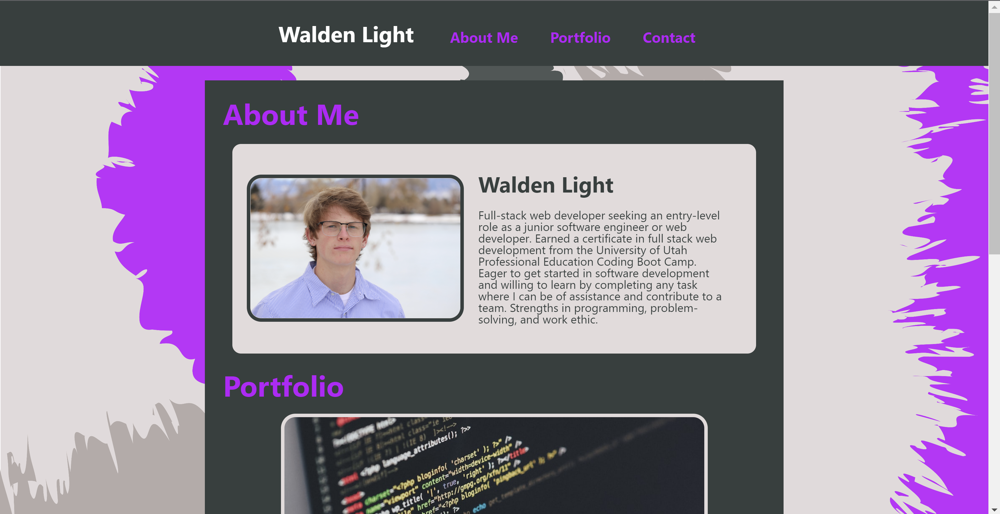

# one-page-portfolio

## A one-page website portfolio of me, Walden Light

I am using this site as a very concise portfolio that displays valuable information about me as a web developer.
In this project, I improved my ability to create responsive websites from scratch.
## Usage

Simply open up the site in GitHub pages: [link](https://waldenlight.github.io/one-page-portfolio/)
Provide instructions and examples for use. Include screenshots as needed.

To add a screenshot, create an `assets/images` folder in your repository and upload your screenshot to it. Then, using the relative filepath, add it to your README using the following syntax:

    

## License

MIT License
